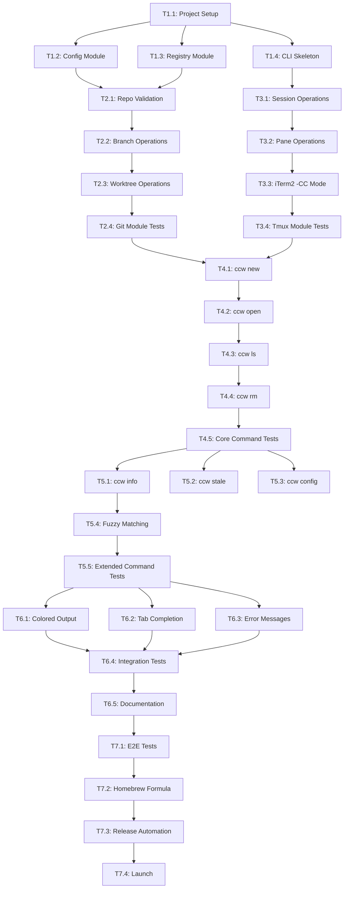

# CCW (Claude Code Workspace) Implementation Plan

A CLI tool for managing Claude Code workspaces with git worktrees and tmux sessions.

---

## Table of Contents

1. [User Journeys](#1-user-journeys)
2. [Requirements](#2-requirements)
3. [Command Line Interface](#3-command-line-interface)
4. [Implementation Details](#4-implementation-details)
5. [Testing Strategy](#5-testing-strategy)
6. [Dependency Graph](#6-dependency-graph)
7. [Language Choice](#7-language-choice)

---

## 1. User Journeys

### Journey 1: Start New Work

**Persona**: Developer starting a new feature or bug fix

**Scenario**:
```
Developer wants to work on a barcode scanner feature for their ingredicheck app.
They want an isolated environment with Claude Code ready to assist.
```

**Steps**:
1. Developer runs: `ccw new ingredicheck feature/barcode-scanner`
2. Tool validates the repo exists at `~/github/ingredicheck`
3. Tool creates branch `feature/barcode-scanner` from `main`
4. Tool creates worktree at `~/.ccw/worktrees/ingredicheck--feature--barcode-scanner`
5. Tool creates tmux session (or iTerm2 -CC session)
6. Left pane: Opens with Claude Code, attempts to rename session
7. Right pane: Opens with lazygit
8. Developer is attached to the session, ready to work

**Success Criteria**:
- Single command to full working environment
- Less than 10 seconds to ready state
- Claude Code and lazygit both running in correct directory

---

### Journey 2: Resume Work (Session Alive)

**Persona**: Developer returning from break, Mac didn't restart

**Scenario**:
```
Developer went to lunch. Tmux session is still running.
They want to pick up exactly where they left off.
```

**Steps**:
1. Developer runs: `ccw open ingredicheck/feature/barcode-scanner`
2. Tool detects tmux session exists
3. Tool attaches to existing session
4. Claude Code still has full context, lazygit shows current state

**Success Criteria**:
- Instant resume (< 1 second)
- All running processes preserved
- No context loss in Claude Code

---

### Journey 3: Resume Work (After Mac Restart)

**Persona**: Developer returning after Mac restart or crash

**Scenario**:
```
Developer's Mac restarted overnight for updates.
Tmux session is gone, but they want to continue the work.
```

**Steps**:
1. Developer runs: `ccw open ingredicheck/feature/barcode-scanner`
2. Tool detects tmux session does not exist
3. Tool looks up workspace in registry, finds worktree path and Claude session name
4. Tool creates new tmux session with same layout
5. Left pane: Runs `claude --resume ingredicheck--feature--barcode-scanner`
6. Right pane: Runs `lazygit`
7. Claude Code resumes from saved conversation history

**Success Criteria**:
- Seamless recovery from restart
- Claude Code conversation history preserved
- Same pane layout as before

---

### Journey 4: Juggle Multiple Tasks

**Persona**: Developer working on multiple features/bugs simultaneously

**Scenario**:
```
Developer is mid-feature when an urgent bug report comes in.
They need to context-switch without losing progress.
```

**Steps**:
1. Developer is working in `ingredicheck/feature/barcode-scanner`
2. Urgent bug: runs `ccw new kin-calendar fix/sync-bug`
3. New workspace opens, developer fixes bug
4. Developer runs `ccw ls` to see all workspaces
5. Developer runs `ccw open ingredicheck/feature/barcode-scanner` to switch back
6. Original context is fully preserved

**Success Criteria**:
- Multiple concurrent workspaces supported
- Easy switching between workspaces
- No cross-contamination between workspaces

---

### Journey 5: List and Inspect Workspaces

**Persona**: Developer managing multiple in-progress tasks

**Scenario**:
```
Developer has several workspaces and wants to see status of each.
```

**Steps**:
1. Developer runs: `ccw ls`
2. Tool displays table of all workspaces with:
   - Workspace name (repo/branch)
   - Tmux session status (alive/dead)
   - Last accessed time
   - Worktree path
3. Developer runs: `ccw info ingredicheck/feature/barcode-scanner`
4. Tool shows detailed info including branch status, Claude session name

**Success Criteria**:
- Clear overview of all workspaces
- Status visibility (which sessions are alive)
- Enough info to make decisions

---

### Journey 6: Cleanup Finished Work

**Persona**: Developer who has merged a feature branch

**Scenario**:
```
Feature branch was merged to main. Developer wants to clean up.
```

**Steps**:
1. Developer runs: `ccw rm ingredicheck/feature/barcode-scanner`
2. Tool checks if branch is merged (warns if not)
3. Tool kills tmux session (if alive)
4. Tool removes git worktree
5. Tool deletes branch
6. Tool removes from registry

**Success Criteria**:
- Complete cleanup in one command
- Safety check for unmerged branches
- No orphaned resources

---

### Journey 7: Find Stale Workspaces

**Persona**: Developer doing periodic cleanup

**Scenario**:
```
Developer wants to find workspaces whose branches have been merged.
```

**Steps**:
1. Developer runs: `ccw stale`
2. Tool lists workspaces where branch is merged to main/master
3. Developer runs: `ccw rm <workspace>` for each, or `ccw rm --all-stale`

**Success Criteria**:
- Easy identification of cleanup candidates
- Batch cleanup option

---

## 2. Requirements

### Functional Requirements

#### FR1: Workspace Creation
- FR1.1: Create git branch from specified base (default: main)
- FR1.2: Create git worktree in managed directory
- FR1.3: Create tmux session with predefined layout
- FR1.4: Launch Claude Code in left pane
- FR1.5: Launch lazygit in right pane
- FR1.6: Attempt to rename Claude Code session for later resume
- FR1.7: Register workspace in persistent storage
- FR1.8: Support iTerm2 -CC mode

#### FR2: Workspace Resume
- FR2.1: Detect if tmux session is alive
- FR2.2: Attach to existing session if alive
- FR2.3: Recreate session layout if dead
- FR2.4: Resume Claude Code by session name
- FR2.5: Handle case where Claude session name not found (fallback to picker)

#### FR3: Workspace Listing
- FR3.1: List all registered workspaces
- FR3.2: Show tmux session status for each
- FR3.3: Show last accessed time
- FR3.4: Show detailed info for single workspace

#### FR4: Workspace Deletion
- FR4.1: Kill tmux session
- FR4.2: Remove git worktree
- FR4.3: Delete git branch (with safety check)
- FR4.4: Remove from registry
- FR4.5: Support --force for unmerged branches
- FR4.6: Support --keep-branch option

#### FR5: Stale Detection
- FR5.1: Identify workspaces with merged branches
- FR5.2: Support batch deletion of stale workspaces

#### FR6: Configuration
- FR6.1: Configurable repos directory (default: ~/github)
- FR6.2: Configurable default base branch
- FR6.3: Configurable layout (pane arrangement)
- FR6.4: Configurable iTerm2 -CC mode toggle

### Non-Functional Requirements

#### NFR1: Performance
- Workspace creation: < 10 seconds
- Workspace attach (alive): < 1 second
- Workspace attach (recreate): < 5 seconds
- List workspaces: < 1 second

#### NFR2: Reliability
- Graceful handling of missing repos
- Graceful handling of existing branches/worktrees
- Atomic operations where possible
- Clear error messages

#### NFR3: Usability
- Intuitive command structure
- Helpful error messages with suggested fixes
- Tab completion for workspace names
- Colored output for readability

#### NFR4: Portability
- macOS support (primary)
- Linux support (secondary)
- No Windows support (tmux not native)

#### NFR5: Maintainability
- Well-documented code
- Comprehensive test suite
- Modular architecture

---

## 3. Command Line Interface

### Command Overview

```
ccw <command> [arguments] [options]

Commands:
  new      Create a new workspace
  open     Open/attach to a workspace
  ls       List all workspaces
  info     Show detailed workspace info
  rm       Remove a workspace
  stale    List workspaces with merged branches
  config   View/edit configuration

Options:
  --help, -h       Show help
  --version, -v    Show version
  --verbose        Enable verbose output
```

### Command Details

#### `ccw new <repo> <branch> [options]`

Create a new workspace.

```
Arguments:
  repo       Repository name (must exist in repos directory)
  branch     Branch name to create (must not exist)

Options:
  --base, -b <branch>    Base branch to create from (default: main)
  --no-attach            Create but don't attach to session
  --message, -m <msg>    Initial prompt to send to Claude Code

Examples:
  ccw new ingredicheck feature/barcode-scanner
  ccw new ingredicheck feature/auth --base develop
  ccw new kin-calendar fix/sync-bug -m "Fix the calendar sync issue"
```

#### `ccw open <workspace>`

Open or attach to an existing workspace.

```
Arguments:
  workspace    Workspace identifier (repo/branch format)
               Supports partial matching

Options:
  --no-resume    Don't resume Claude Code session (start fresh)

Examples:
  ccw open ingredicheck/feature/barcode-scanner
  ccw open ingredicheck/feat    # Partial match
  ccw open barcode              # Fuzzy match
```

#### `ccw ls [options]`

List all workspaces.

```
Options:
  --all, -a        Show all details
  --json           Output as JSON
  --repo <repo>    Filter by repository

Output columns:
  WORKSPACE          Repo/branch identifier
  STATUS             tmux session status (alive/dead)
  LAST ACCESSED      Time since last access
  
Examples:
  ccw ls
  ccw ls --repo ingredicheck
  ccw ls --json
```

#### `ccw info <workspace>`

Show detailed information about a workspace.

```
Arguments:
  workspace    Workspace identifier

Output:
  - Workspace name
  - Repository path
  - Worktree path
  - Branch name
  - Base branch
  - Claude session name
  - Tmux session status
  - Created date
  - Last accessed date
  - Branch merged status

Examples:
  ccw info ingredicheck/feature/barcode-scanner
```

#### `ccw rm <workspace> [options]`

Remove a workspace.

```
Arguments:
  workspace    Workspace identifier

Options:
  --force, -f       Force removal even if branch not merged
  --keep-branch     Don't delete the git branch
  --keep-worktree   Don't delete the worktree (just unregister)

Examples:
  ccw rm ingredicheck/feature/barcode-scanner
  ccw rm ingredicheck/feature/wip --force
  ccw rm ingredicheck/feature/shared --keep-branch
```

#### `ccw stale [options]`

List workspaces with merged branches.

```
Options:
  --rm              Remove all stale workspaces (interactive)
  --rm --force      Remove all stale workspaces (no confirmation)

Examples:
  ccw stale
  ccw stale --rm
```

#### `ccw config [key] [value]`

View or edit configuration.

```
Arguments:
  key      Configuration key (optional)
  value    New value (optional)

Keys:
  repos_dir           Path to repositories (default: ~/github)
  default_base        Default base branch (default: main)
  iterm_cc_mode       Use iTerm2 -CC mode (default: true)
  claude_rename_delay Seconds to wait before renaming (default: 5)
  
Examples:
  ccw config                         # Show all config
  ccw config repos_dir               # Show single value
  ccw config repos_dir ~/projects    # Set value
  ccw config --reset                 # Reset to defaults
```

### Exit Codes

```
0    Success
1    General error
2    Invalid arguments
3    Workspace not found
4    Repository not found
5    Branch already exists
6    Git operation failed
7    Tmux operation failed
```

---

## 4. Implementation Details

### Directory Structure

```
~/.ccw/
├── config.json              # User configuration
├── workspaces.json          # Workspace registry
└── worktrees/               # Git worktrees
    ├── ingredicheck--feature--barcode-scanner/
    └── kin-calendar--fix--sync-bug/

~/github/                    # User's repos (configurable)
├── ingredicheck/
└── kin-calendar/
```

### Data Structures

#### config.json
```json
{
  "version": 1,
  "repos_dir": "~/github",
  "default_base": "main",
  "iterm_cc_mode": true,
  "claude_rename_delay": 5,
  "layout": {
    "left": "claude",
    "right": "lazygit"
  }
}
```

#### workspaces.json
```json
{
  "version": 1,
  "workspaces": {
    "ingredicheck/feature/barcode-scanner": {
      "repo": "ingredicheck",
      "repo_path": "/Users/dev/github/ingredicheck",
      "branch": "feature/barcode-scanner",
      "base_branch": "main",
      "worktree_path": "/Users/dev/.ccw/worktrees/ingredicheck--feature--barcode-scanner",
      "claude_session": "ingredicheck--feature--barcode-scanner",
      "tmux_session": "ingredicheck--feature--barcode-scanner",
      "created_at": "2025-01-15T10:30:00Z",
      "last_accessed_at": "2025-01-15T14:22:00Z"
    }
  }
}
```

### Module Architecture

```
ccw/
├── main.go (or main.rs)     # Entry point, CLI parsing
├── cmd/                     # Command implementations
│   ├── new.go
│   ├── open.go
│   ├── ls.go
│   ├── info.go
│   ├── rm.go
│   ├── stale.go
│   └── config.go
├── internal/
│   ├── workspace/           # Workspace management
│   │   ├── workspace.go     # Core types and methods
│   │   ├── registry.go      # Load/save workspaces.json
│   │   └── naming.go        # Name generation, validation
│   ├── git/                 # Git operations
│   │   ├── worktree.go      # Worktree create/remove
│   │   ├── branch.go        # Branch create/delete/check merged
│   │   └── repo.go          # Repo validation
│   ├── tmux/                # Tmux operations
│   │   ├── session.go       # Session create/attach/kill
│   │   ├── pane.go          # Pane management
│   │   └── iterm.go         # iTerm2 -CC specifics
│   ├── claude/              # Claude Code operations
│   │   ├── launch.go        # Launch Claude Code
│   │   └── rename.go        # Session renaming
│   └── config/              # Configuration
│       └── config.go        # Load/save config.json
└── pkg/
    └── ui/                  # User interface utilities
        ├── table.go         # Table formatting
        ├── color.go         # Colored output
        └── prompt.go        # Interactive prompts
```

### Key Algorithms

#### Workspace Name Generation
```
Input: repo="ingredicheck", branch="feature/barcode-scanner"
Output: 
  - workspace_id: "ingredicheck/feature/barcode-scanner"
  - safe_name: "ingredicheck--feature--barcode-scanner"  # For paths/sessions
  
Algorithm:
  1. workspace_id = repo + "/" + branch
  2. safe_name = replace(workspace_id, "/", "--")
  3. Validate: safe_name must be valid tmux session name
```

#### Session Resurrection
```
Input: workspace
Output: attached tmux session with Claude Code + lazygit

Algorithm:
  1. Check if tmux session exists:
     - Run: tmux has-session -t {safe_name}
     - If exit code 0: session exists
  
  2. If session exists:
     - Attach: tmux attach -t {safe_name} (or tmux -CC attach)
  
  3. If session does not exist:
     a. Create new session:
        tmux new-session -d -s {safe_name} -c {worktree_path}
     b. Split pane:
        tmux split-window -h -t {safe_name} -c {worktree_path}
     c. Send commands to panes:
        tmux send-keys -t {safe_name}:0.0 "claude --resume {safe_name}" Enter
        tmux send-keys -t {safe_name}:0.1 "lazygit" Enter
     d. Attach:
        tmux attach -t {safe_name}
```

#### Branch Merged Detection
```
Input: repo_path, branch_name, base_branch
Output: boolean (is merged)

Algorithm:
  1. cd to repo_path
  2. Fetch latest: git fetch origin
  3. Check if merged:
     git branch --merged origin/{base_branch} | grep {branch_name}
  4. If found: return true
  5. Else: return false
```

### iTerm2 -CC Mode Handling

When `iterm_cc_mode` is true:

```
Create session:
  tmux -CC new-session -d -s {name} -c {path}
  
Split:
  tmux -CC split-window -h -t {name}
  
Attach:
  tmux -CC attach -t {name}
```

Note: In -CC mode, iTerm2 converts tmux constructs to native UI. The commands are the same, just prefixed with `-CC`.

### Error Handling

| Error | Message | Suggestion |
|-------|---------|------------|
| Repo not found | Repository 'foo' not found at ~/github/foo | Check the path or run `ccw config repos_dir` |
| Branch exists | Branch 'feature/x' already exists | Use a different name or delete the existing branch |
| Worktree exists | Worktree already exists at ~/.ccw/worktrees/... | Remove with `ccw rm` or check for conflicts |
| Tmux not installed | tmux command not found | Install with `brew install tmux` |
| Claude Code not installed | claude command not found | Install Claude Code CLI |

---

## 5. Testing Strategy

### Unit Tests

#### Git Module Tests
```
test_create_branch_success
test_create_branch_already_exists
test_delete_branch_success
test_delete_branch_not_merged_error
test_delete_branch_force
test_is_branch_merged_true
test_is_branch_merged_false
test_create_worktree_success
test_remove_worktree_success
test_validate_repo_exists
test_validate_repo_not_found
```

#### Workspace Module Tests
```
test_workspace_name_generation
test_workspace_name_special_chars
test_registry_load_empty
test_registry_load_existing
test_registry_save
test_registry_add_workspace
test_registry_remove_workspace
test_registry_find_by_partial_name
```

#### Config Module Tests
```
test_config_load_defaults
test_config_load_existing
test_config_save
test_config_get_value
test_config_set_value
test_config_expand_tilde
```

#### Tmux Module Tests
```
test_session_exists_true
test_session_exists_false
test_create_session
test_kill_session
test_split_pane
test_send_keys
```

### Integration Tests

```
test_full_workflow_create_and_attach
  1. Create workspace
  2. Verify branch exists
  3. Verify worktree exists
  4. Verify tmux session exists
  5. Kill session
  6. Re-open workspace
  7. Verify session recreated

test_full_workflow_cleanup
  1. Create workspace
  2. Make commits, merge to main
  3. Run stale detection
  4. Remove workspace
  5. Verify all resources cleaned up

test_multiple_workspaces
  1. Create workspace A
  2. Create workspace B
  3. List shows both
  4. Switch between them
  5. Remove A
  6. B still works

test_resume_after_session_death
  1. Create workspace
  2. Kill tmux session externally
  3. Open workspace
  4. Verify session recreated
  5. Verify claude --resume called
```

### End-to-End Tests

```
test_e2e_new_open_rm
  Full user journey with real git repo, tmux, filesystem

test_e2e_iterm_cc_mode
  Verify iTerm2 integration works (manual or screenshot comparison)

test_e2e_claude_code_resume
  Verify Claude Code actually resumes (may need mocking)
```

### Test Infrastructure

#### Test Fixtures
- Sample git repositories (bare repos for fast cloning)
- Pre-populated workspaces.json files
- Config files with various settings

#### Mocking
- Mock git commands for unit tests
- Mock tmux commands for unit tests
- Mock filesystem for registry tests

#### CI/CD Pipeline
```yaml
name: CI

on: [push, pull_request]

jobs:
  test:
    runs-on: macos-latest
    steps:
      - uses: actions/checkout@v4
      - name: Install dependencies
        run: |
          brew install tmux
          # Install Go or Rust
      - name: Run unit tests
        run: make test-unit
      - name: Run integration tests
        run: make test-integration
        
  lint:
    runs-on: ubuntu-latest
    steps:
      - uses: actions/checkout@v4
      - name: Lint
        run: make lint
        
  build:
    runs-on: macos-latest
    needs: [test, lint]
    steps:
      - uses: actions/checkout@v4
      - name: Build
        run: make build
      - name: Upload artifact
        uses: actions/upload-artifact@v4
        with:
          name: ccw
          path: dist/ccw
```

---

## 6. Dependency Graph

### Todo Items

```
PHASE 1: Foundation
├── T1.1: Project setup (repo, build system, CI)
├── T1.2: Config module (load, save, defaults)
├── T1.3: Registry module (load, save, CRUD)
└── T1.4: CLI skeleton (argument parsing, help)

PHASE 2: Git Operations
├── T2.1: Repo validation
├── T2.2: Branch operations (create, delete, check merged)
├── T2.3: Worktree operations (create, remove, list)
└── T2.4: Git module tests

PHASE 3: Tmux Operations
├── T3.1: Session operations (create, kill, exists, attach)
├── T3.2: Pane operations (split, send-keys)
├── T3.3: iTerm2 -CC mode support
└── T3.4: Tmux module tests

PHASE 4: Commands - Core
├── T4.1: `ccw new` command
├── T4.2: `ccw open` command
├── T4.3: `ccw ls` command
├── T4.4: `ccw rm` command
└── T4.5: Core command tests

PHASE 5: Commands - Extended
├── T5.1: `ccw info` command
├── T5.2: `ccw stale` command
├── T5.3: `ccw config` command
├── T5.4: Partial/fuzzy workspace matching
└── T5.5: Extended command tests

PHASE 6: Polish
├── T6.1: Colored output
├── T6.2: Tab completion (bash, zsh, fish)
├── T6.3: Error messages and suggestions
├── T6.4: Integration tests
└── T6.5: Documentation (README, man page)

PHASE 7: Release
├── T7.1: End-to-end tests
├── T7.2: Homebrew formula
├── T7.3: Release automation
└── T7.4: Launch (GitHub release, announce)
```

### Dependency Graph (Mermaid)



### Critical Path

```
T1.1 → T1.2 → T2.1 → T2.2 → T2.3 → T2.4 → T4.1 → T4.2 → T4.4 → T4.5 → T6.4 → T7.1 → T7.4
```

Estimated time: ~40-60 hours for MVP (through T4.5)

---

## 7. Language Choice

### Recommendation: **Go**

### Rationale

| Criterion | Go | Rust | Python | Bash |
|-----------|-----|------|--------|------|
| Single binary | ✅ | ✅ | ❌ | ❌ |
| Fast startup | ✅ | ✅ | ❌ | ✅ |
| Cross-compile | ✅ | ✅ | ❌ | N/A |
| Learning curve | Low | High | Low | Low |
| CLI libraries | Excellent (Cobra) | Excellent (Clap) | Good (Click) | Manual |
| Community adoption for CLI tools | Very high | High | Medium | Medium |
| Maintainability | High | Very high | Medium | Low |
| Contributor accessibility | High | Medium | High | High |

### Why Go over Rust?

1. **Lower barrier for contributors**: Go is easier to learn, attracting more open-source contributors
2. **Faster development**: Less fighting with the borrow checker for a tool that doesn't need Rust's safety guarantees
3. **CLI ecosystem**: Cobra + Viper is the gold standard for CLI tools (kubectl, gh, docker all use it)
4. **Fast enough**: Startup time is imperceptible for this use case

### Why Not Python?

1. **Distribution**: Requires Python runtime on user machines
2. **Startup time**: Noticeable lag for simple commands
3. **Single binary**: Would need PyInstaller, adds complexity

### Why Not Bash?

1. **Complexity**: Error handling, JSON parsing become painful
2. **Testing**: Much harder to test properly
3. **Maintainability**: Quickly becomes unmaintainable at this scale

### Recommended Stack

```
Language:       Go 1.22+
CLI Framework:  Cobra (github.com/spf13/cobra)
Config:         Viper (github.com/spf13/viper)
Testing:        Standard library + testify
JSON:           Standard library
Colors:         Fatih/color (github.com/fatih/color)
Tables:         Tablewriter (github.com/olekukonko/tablewriter)
```

### Installation Methods

1. **Homebrew** (primary)
   ```bash
   brew install ccw
   ```

2. **Go install**
   ```bash
   go install github.com/yourname/ccw@latest
   ```

3. **Binary download**
   - GitHub releases with binaries for macOS (arm64, amd64) and Linux

---

## Appendix: Quick Reference

### File Locations

| File | Purpose |
|------|---------|
| `~/.ccw/config.json` | User configuration |
| `~/.ccw/workspaces.json` | Workspace registry |
| `~/.ccw/worktrees/` | Git worktrees |
| `~/github/` | User repos (configurable) |

### Session Naming Convention

```
Workspace ID:    ingredicheck/feature/barcode-scanner
Tmux Session:    ingredicheck--feature--barcode-scanner
Claude Session:  ingredicheck--feature--barcode-scanner
Worktree Dir:    ingredicheck--feature--barcode-scanner
```

### Quick Commands

```bash
ccw new ingredicheck feature/x    # Start new work
ccw open ingredicheck/feature/x   # Resume work
ccw ls                            # List all
ccw rm ingredicheck/feature/x     # Cleanup
```
