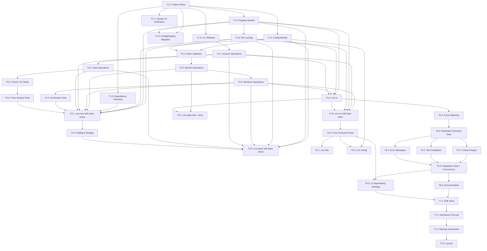

# CCW (Claude Code Workspace) Implementation Plan

A CLI tool for managing Claude Code workspaces with git worktrees and tmux sessions.

---

## Table of Contents

1. [User Journeys](#1-user-journeys)
2. [Requirements](#2-requirements)
3. [Command Line Interface](#3-command-line-interface)
4. [Implementation Details](#4-implementation-details)
5. [Testing Strategy](#5-testing-strategy)
6. [Dependency Graph](#6-dependency-graph)
7. [Language Choice](#7-language-choice)

---

## 1. User Journeys

### Journey 1: Start New Work

**Persona**: Developer starting a new feature or bug fix

**Scenario**:
```
Developer wants to work on a barcode scanner feature for their ingredicheck app.
They want an isolated environment with Claude Code ready to assist.
```

**Steps**:
1. Developer runs: `ccw new ingredicheck feature/barcode-scanner`
2. Tool validates the repo exists at `~/github/ingredicheck`
3. Tool creates branch `feature/barcode-scanner` from `main`
4. Tool creates worktree at `~/.ccw/worktrees/ingredicheck--feature--barcode-scanner`
5. Tool creates tmux session (or iTerm2 -CC session)
6. Left pane: Opens with Claude Code, attempts to rename session
7. Right pane: Opens with lazygit
8. Developer is attached to the session, ready to work

**Success Criteria**:
- Single command to full working environment
- Less than 10 seconds to ready state
- Claude Code and lazygit both running in correct directory

---

### Journey 2: Resume Work (Session Alive)

**Persona**: Developer returning from break, Mac didn't restart

**Scenario**:
```
Developer went to lunch. Tmux session is still running.
They want to pick up exactly where they left off.
```

**Steps**:
1. Developer runs: `ccw open ingredicheck/feature/barcode-scanner`
2. Tool detects tmux session exists
3. Tool attaches to existing session
4. Claude Code still has full context, lazygit shows current state

**Success Criteria**:
- Instant resume (< 1 second)
- All running processes preserved
- No context loss in Claude Code

---

### Journey 3: Resume Work (After Mac Restart)

**Persona**: Developer returning after Mac restart or crash

**Scenario**:
```
Developer's Mac restarted overnight for updates.
Tmux session is gone, but they want to continue the work.
```

**Steps**:
1. Developer runs: `ccw open ingredicheck/feature/barcode-scanner`
2. Tool detects tmux session does not exist
3. Tool looks up workspace in registry, finds worktree path and Claude session name
4. Tool creates new tmux session with same layout
5. Left pane: Runs `claude --resume ingredicheck--feature--barcode-scanner`
6. Right pane: Runs `lazygit`
7. Claude Code resumes from saved conversation history

**Success Criteria**:
- Seamless recovery from restart
- Claude Code conversation history preserved
- Same pane layout as before

---

### Journey 4: Juggle Multiple Tasks

**Persona**: Developer working on multiple features/bugs simultaneously

**Scenario**:
```
Developer is mid-feature when an urgent bug report comes in.
They need to context-switch without losing progress.
```

**Steps**:
1. Developer is working in `ingredicheck/feature/barcode-scanner`
2. Urgent bug: runs `ccw new kin-calendar fix/sync-bug`
3. New workspace opens, developer fixes bug
4. Developer runs `ccw ls` to see all workspaces
5. Developer runs `ccw open ingredicheck/feature/barcode-scanner` to switch back
6. Original context is fully preserved

**Success Criteria**:
- Multiple concurrent workspaces supported
- Easy switching between workspaces
- No cross-contamination between workspaces

---

### Journey 5: List and Inspect Workspaces

**Persona**: Developer managing multiple in-progress tasks

**Scenario**:
```
Developer has several workspaces and wants to see status of each.
```

**Steps**:
1. Developer runs: `ccw ls`
2. Tool displays table of all workspaces with:
   - Workspace name (repo/branch)
   - Tmux session status (alive/dead)
   - Last accessed time
   - Worktree path
3. Developer runs: `ccw info ingredicheck/feature/barcode-scanner`
4. Tool shows detailed info including branch status, Claude session name

**Success Criteria**:
- Clear overview of all workspaces
- Status visibility (which sessions are alive)
- Enough info to make decisions

---

### Journey 6: Cleanup Finished Work

**Persona**: Developer who has merged a feature branch

**Scenario**:
```
Feature branch was merged to main. Developer wants to clean up.
```

**Steps**:
1. Developer runs: `ccw rm ingredicheck/feature/barcode-scanner`
2. Tool checks if branch is merged (warns if not)
3. Tool kills tmux session (if alive)
4. Tool removes git worktree
5. Tool deletes branch
6. Tool removes from registry

**Success Criteria**:
- Complete cleanup in one command
- Safety check for unmerged branches
- No orphaned resources

---

### Journey 7: Find Stale Workspaces

**Persona**: Developer doing periodic cleanup

**Scenario**:
```
Developer wants to find workspaces whose branches have been merged.
```

**Steps**:
1. Developer runs: `ccw stale`
2. Tool lists workspaces where branch is merged to main/master
3. Developer runs: `ccw rm <workspace>` for each, or `ccw rm --all-stale`

**Success Criteria**:
- Easy identification of cleanup candidates
- Batch cleanup option

---

## 2. Requirements

### Functional Requirements

#### FR1: Workspace Creation
- FR1.1: Check required dependencies before execution (git, tmux, claude)
- FR1.2: Create git branch from specified base (default: main)
- FR1.3: Create git worktree in managed directory
- FR1.4: Create tmux session with predefined layout
- FR1.5: Launch Claude Code in left pane
- FR1.6: Launch lazygit in right pane (warn if not installed)
- FR1.7: Attempt to rename Claude Code session for later resume
- FR1.8: Register workspace in persistent storage with file locking
- FR1.9: Support iTerm2 -CC mode
- FR1.10: Rollback on partial failure (cleanup branch/worktree/session if any step fails)
- FR1.11: Fetch/prune base branch before create, detect existing remote branch, and set upstream tracking on new branch

#### FR2: Workspace Resume
- FR2.1: Check required dependencies before execution (git, tmux, claude)
- FR2.2: Detect if tmux session is alive
- FR2.3: Attach to existing session if alive
- FR2.4: Recreate session layout if dead
- FR2.5: Resume Claude Code by session name (using `claude --resume {session_name}`)
- FR2.6: Handle case where Claude session name not found (fallback to picker)

#### FR3: Workspace Listing
- FR3.1: List all registered workspaces
- FR3.2: Show tmux session status for each
- FR3.3: Show last accessed time
- FR3.4: Show detailed info for single workspace

#### FR4: Workspace Deletion
- FR4.1: Check required dependencies before execution (git, tmux)
- FR4.2: Kill tmux session
- FR4.3: Remove git worktree
- FR4.4: Delete git branch (with safety check)
- FR4.5: Remove from registry with file locking
- FR4.6: Support --force for unmerged branches
- FR4.7: Support --keep-branch option
- FR4.8: Continue cleanup even if individual steps fail (best-effort)
- FR4.9: Refuse deletion without confirmation (or --force) when branch is unmerged or has unpushed/uncommitted work

#### FR5: Stale Detection
- FR5.1: Check required dependencies before execution (git)
- FR5.2: Identify workspaces with merged branches
- FR5.3: Support batch deletion of stale workspaces
- FR5.4: Support --force option for manual override of merge detection

#### FR6: Configuration
- FR6.1: Configurable repos directory (default: ~/github)
- FR6.2: Configurable default base branch
- FR6.3: Configurable layout (pane arrangement)
- FR6.4: Configurable iTerm2 -CC mode toggle

### Non-Functional Requirements

#### NFR1: Performance
- Workspace creation: < 10 seconds
- Workspace attach (alive): < 1 second
- Workspace attach (recreate): < 5 seconds
- List workspaces: < 1 second

#### NFR2: Reliability
- Dependency validation before command execution with clear installation instructions
- Graceful handling of missing repos
- Graceful handling of existing branches/worktrees
- File locking for registry operations to prevent concurrent corruption
- Atomic operations with rollback on partial failure
- Best-effort cleanup even when individual steps fail
- Clear error messages with actionable suggestions
- Registry repair capabilities for detecting inconsistencies

#### NFR3: Usability
- Intuitive command structure
- Helpful error messages with suggested fixes
- Tab completion for workspace names
- Colored output for readability

#### NFR4: Portability
- macOS support (primary)
- Linux support (secondary)
- No Windows support (tmux not native)

#### NFR5: Maintainability
- Well-documented code
- Comprehensive test suite
- Modular architecture

---

## 3. Command Line Interface

### Command Overview

```
ccw <command> [arguments] [options]

Commands:
  new      Create a new workspace
  open     Open/attach to a workspace
  ls       List all workspaces
  info     Show detailed workspace info
  rm       Remove a workspace
  stale    List workspaces with merged branches
  config   View/edit configuration

Options:
  --help, -h       Show help
  --version, -v    Show version
  --verbose        Enable verbose output
```

### Command Details

#### `ccw new <repo> <branch> [options]`

Create a new workspace.

```
Arguments:
  repo       Repository name (must exist in repos directory)
  branch     Branch name to create (must not exist)

Options:
  --base, -b <branch>    Base branch to create from (default: main)
  --no-attach            Create but don't attach to session
  --message, -m <msg>    Initial prompt to send to Claude Code
  --no-fetch             Skip fetch/prune of base (not recommended)

Examples:
  ccw new ingredicheck feature/barcode-scanner
  ccw new ingredicheck feature/auth --base develop
  ccw new kin-calendar fix/sync-bug -m "Fix the calendar sync issue"
```

#### `ccw open <workspace>`

Open or attach to an existing workspace.

```
Arguments:
  workspace    Workspace identifier (repo/branch format)
               Supports partial matching

Options:
  --no-resume    Don't resume Claude Code session (start fresh)

Examples:
  ccw open ingredicheck/feature/barcode-scanner
  ccw open ingredicheck/feat    # Partial match
  ccw open barcode              # Fuzzy match

Matching rules (in order):
1) Exact match
2) Single unambiguous prefix
3) Fuzzy; if multiple match, prompt instead of auto-select
```

#### `ccw ls [options]`

List all workspaces.

```
Options:
  --all, -a        Show all details
  --json           Output as JSON
  --repo <repo>    Filter by repository

Output columns:
  WORKSPACE          Repo/branch identifier
  STATUS             tmux session status (alive/dead)
  LAST ACCESSED      Time since last access
  
Examples:
  ccw ls
  ccw ls --repo ingredicheck
  ccw ls --json
```

#### `ccw info <workspace>`

Show detailed information about a workspace.

```
Arguments:
  workspace    Workspace identifier

Output:
  - Workspace name
  - Repository path
  - Worktree path
  - Branch name
  - Base branch
  - Claude session name
  - Tmux session status
  - Created date
  - Last accessed date
  - Branch merged status

Examples:
  ccw info ingredicheck/feature/barcode-scanner
```

#### `ccw rm <workspace> [options]`

Remove a workspace.

```
Arguments:
  workspace    Workspace identifier

Options:
  --force, -f       Force removal even if branch not merged
  --keep-branch     Don't delete the git branch
  --keep-worktree   Don't delete the worktree (just unregister)
  --yes             Skip interactive confirmation when unmerged/unpushed changes exist

Examples:
  ccw rm ingredicheck/feature/barcode-scanner
  ccw rm ingredicheck/feature/wip --force
  ccw rm ingredicheck/feature/shared --keep-branch
```

#### `ccw stale [options]`

List workspaces with merged branches.

```
Options:
  --rm              Remove all stale workspaces (interactive)
  --rm --force      Remove all stale workspaces (no confirmation)

Examples:
  ccw stale
  ccw stale --rm
```

#### `ccw config [key] [value]`

View or edit configuration.

```
Arguments:
  key      Configuration key (optional)
  value    New value (optional)

Keys:
  repos_dir           Path to repositories (default: ~/github)
  default_base        Default base branch (default: main)
  iterm_cc_mode       Use iTerm2 -CC mode (default: true)
  claude_rename_delay Seconds to wait before renaming (default: 5)
  
Examples:
  ccw config                         # Show all config
  ccw config repos_dir               # Show single value
  ccw config repos_dir ~/projects    # Set value
  ccw config --reset                 # Reset to defaults
```

### Exit Codes

```
0    Success
1    General error
2    Invalid arguments
3    Workspace not found
4    Repository not found
5    Branch already exists
6    Git operation failed
7    Tmux operation failed
```

---

## 4. Implementation Details

### Directory Structure

```
~/.ccw/
├── config.json              # User configuration
├── workspaces.json          # Workspace registry
└── worktrees/               # Git worktrees
    ├── ingredicheck--feature--barcode-scanner/
    └── kin-calendar--fix--sync-bug/

~/github/                    # User's repos (configurable)
├── ingredicheck/
└── kin-calendar/
```

### Data Structures

#### config.json
```json
{
  "version": 1,
  "repos_dir": "~/github",
  "default_base": "main",
  "iterm_cc_mode": true,
  "claude_rename_delay": 5,
  "layout": {
    "left": "claude",
    "right": "lazygit"
  }
}
```

#### workspaces.json
```json
{
  "version": 1,
  "workspaces": {
    "ingredicheck/feature/barcode-scanner": {
      "repo": "ingredicheck",
      "repo_path": "/Users/dev/github/ingredicheck",
      "branch": "feature/barcode-scanner",
      "base_branch": "main",
      "worktree_path": "/Users/dev/.ccw/worktrees/ingredicheck--feature--barcode-scanner",
      "claude_session": "ingredicheck--feature--barcode-scanner",
      "tmux_session": "ingredicheck--feature--barcode-scanner",
      "created_at": "2025-01-15T10:30:00Z",
      "last_accessed_at": "2025-01-15T14:22:00Z"
    }
  }
}
```

### Module Architecture

```
ccw/
├── main.go (or main.rs)     # Entry point, CLI parsing
├── cmd/                     # Command implementations
│   ├── new.go
│   ├── open.go
│   ├── ls.go
│   ├── info.go
│   ├── rm.go
│   ├── stale.go
│   └── config.go
├── internal/
│   ├── deps/                # Dependency checking
│   │   └── deps.go          # Check/warn for git, tmux, claude, lazygit
│   ├── workspace/           # Workspace management
│   │   ├── workspace.go     # Core types and methods
│   │   ├── registry.go      # Load/save workspaces.json with file locking
│   │   ├── naming.go        # Name generation, validation
│   │   └── rollback.go      # Rollback/cleanup on partial failure
│   ├── git/                 # Git operations
│   │   ├── worktree.go      # Worktree create/remove
│   │   ├── branch.go        # Branch create/delete/check merged
│   │   └── repo.go          # Repo validation
│   ├── tmux/                # Tmux operations
│   │   ├── session.go       # Session create/attach/kill
│   │   ├── pane.go          # Pane management
│   │   └── iterm.go         # iTerm2 -CC specifics
│   ├── claude/              # Claude Code operations
│   │   ├── launch.go        # Launch Claude Code
│   │   └── rename.go        # Session renaming
│   └── config/              # Configuration
│       └── config.go        # Load/save config.json
└── pkg/
    └── ui/                  # User interface utilities
        ├── table.go         # Table formatting
        ├── color.go         # Colored output
        └── prompt.go        # Interactive prompts
```

### Key Algorithms

#### Workspace Name Generation
```
Input: repo="ingredicheck", branch="feature/barcode-scanner"
Output: 
  - workspace_id: "ingredicheck/feature/barcode-scanner"
  - safe_name: "ingredicheck--feature--barcode-scanner"  # For paths/sessions
  
Algorithm:
  1. workspace_id = repo + "/" + branch
  2. safe_name = normalize workspace_id by replacing "/" with "--", stripping/encoding characters outside [A-Za-z0-9_.-], and truncating to tmux-safe length
  3. If collision after normalization, append a short hash suffix
  4. Validate: safe_name must be valid tmux session name and filesystem-safe
```

#### Session Resurrection
```
Input: workspace
Output: attached tmux session with Claude Code + lazygit

Algorithm:
  1. Check if tmux session exists:
     - Run: tmux has-session -t {safe_name}
     - If exit code 0: session exists
  
  2. If session exists:
     - Attach: tmux attach -t {safe_name} (or tmux -CC attach)
  
  3. If session does not exist:
     a. Create new session:
        tmux new-session -d -s {safe_name} -c {worktree_path}
     b. Split pane:
        tmux split-window -h -t {safe_name} -c {worktree_path}
     c. Send commands to panes:
        tmux send-keys -t {safe_name}:0.0 "claude --resume {safe_name}" Enter
        tmux send-keys -t {safe_name}:0.1 "lazygit" Enter
     d. Attach:
        tmux attach -t {safe_name}
```

#### Branch Merged Detection
```
Input: repo_path, branch_name, base_branch
Output: boolean (is merged)

Algorithm:
  1. cd to repo_path
  2. Fetch/prune remotes: git fetch --prune (on failure: surface error, do not assume merged)
  3. Resolve base: prefer branch upstream (origin/{base_branch}); if missing, fail with guidance
  4. Verify branch exists locally; if only remote exists, treat as not merged and warn
  5. Check merge: git merge-base --is-ancestor {branch_name} origin/{base_branch}
       - exit 0 → merged
       - exit 1 → not merged
       - other → error
  6. Avoid substring matches entirely; rely on merge-base result
```

### iTerm2 -CC Mode Handling

When `iterm_cc_mode` is true:

```
Create session:
  tmux -CC new-session -d -s {name} -c {path}
  
Split:
  tmux -CC split-window -h -t {name}
  
Attach:
  tmux -CC attach -t {name}
```

Note: In -CC mode, iTerm2 converts tmux constructs to native UI. The commands are the same, just prefixed with `-CC`.

### Error Handling

#### Dependency Errors

| Error | Message | Suggestion |
|-------|---------|------------|
| Git not installed | git command not found | Install with `brew install git` (macOS) or package manager |
| Tmux not installed | tmux command not found | Install with `brew install tmux` (macOS) or `apt-get install tmux` (Linux) |
| Claude Code not installed | claude command not found | Install Claude Code CLI: https://claude.com/claude-code |
| Lazygit not installed (warning) | lazygit not found (continuing without) | Optional: Install with `brew install lazygit` |

#### Workspace Operation Errors

| Error | Message | Suggestion |
|-------|---------|------------|
| Repo not found | Repository 'foo' not found at ~/github/foo | Check the path or run `ccw config repos_dir` |
| Branch exists | Branch 'feature/x' already exists | Use a different name or delete the existing branch |
| Worktree exists | Worktree already exists at ~/.ccw/worktrees/... | Remove with `ccw rm` or check for conflicts |
| Registry locked | Registry file is locked by another process | Wait a moment and try again |
| Partial failure during creation | Failed to create tmux session (cleaned up branch and worktree) | Check tmux installation and try again |
| Branch not merged / unpushed work | Branch has unmerged or unpushed commits | Confirm with --force/--yes or merge/push first |

#### Rollback Strategy

When `ccw new` fails partway through, rollback in reverse order:
```
1. If tmux session created → kill session
2. If worktree created → remove worktree
3. If branch created → delete branch
4. If registry updated → remove entry (with file lock)
```

When `ccw rm` fails partway through, continue best-effort:
```
1. Try to kill tmux session (warn if fails)
2. Try to remove worktree (warn if fails)
3. Try to delete branch (warn if fails, skip if --keep-branch)
4. Always remove from registry (critical step)
```

#### File Locking Strategy

Registry operations use file locking to prevent concurrent corruption:
```go
1. Acquire exclusive lock on workspaces.json.lock
2. Read workspaces.json
3. Modify in memory
4. Write to workspaces.json.tmp
5. Rename workspaces.json.tmp → workspaces.json (atomic)
6. Release lock
```

#### Config/Registry Versioning & Migration

1. Validate schema version on load; refuse to proceed with unsupported versions and show upgrade guidance
2. Always write via temp file + atomic rename, and keep a timestamped backup before migration
3. On version bump, run explicit migration steps; keep migrations idempotent and test-covered
4. If corruption detected, offer auto-restore from latest backup and log the recovery path

---

## 5. Testing Strategy

### Unit Tests

#### Git Module Tests
```
test_create_branch_success
test_create_branch_already_exists
test_delete_branch_success
test_delete_branch_not_merged_error
test_delete_branch_force
test_is_branch_merged_true
test_is_branch_merged_false
test_create_worktree_success
test_remove_worktree_success
test_validate_repo_exists
test_validate_repo_not_found
```

#### Workspace Module Tests
```
test_workspace_name_generation
test_workspace_name_special_chars
test_registry_load_empty
test_registry_load_existing
test_registry_save
test_registry_add_workspace
test_registry_remove_workspace
test_registry_find_by_partial_name
```

#### Config Module Tests
```
test_config_load_defaults
test_config_load_existing
test_config_save
test_config_get_value
test_config_set_value
test_config_expand_tilde
```

#### Dependency Module Tests
```
test_check_dependency_exists
test_check_dependency_missing
test_check_multiple_dependencies
test_warn_optional_dependencies
test_install_command_generation_macos
test_install_command_generation_linux
```

#### Registry File Locking Tests
```
test_registry_lock_acquire
test_registry_lock_timeout
test_registry_concurrent_writes_blocked
test_registry_atomic_write
test_registry_lock_cleanup_on_error
```

#### Rollback Tests
```
test_rollback_after_branch_creation
test_rollback_after_worktree_creation
test_rollback_after_tmux_creation
test_rollback_full_cleanup
test_rollback_idempotent
```

#### Tmux Module Tests
```
test_session_exists_true
test_session_exists_false
test_create_session
test_kill_session
test_split_pane
test_send_keys
```

### Integration Tests

```
test_full_workflow_create_and_attach
  1. Create workspace
  2. Verify branch exists
  3. Verify worktree exists
  4. Verify tmux session exists
  5. Kill session
  6. Re-open workspace
  7. Verify session recreated

test_full_workflow_cleanup
  1. Create workspace
  2. Make commits, merge to main
  3. Run stale detection
  4. Remove workspace
  5. Verify all resources cleaned up

test_multiple_workspaces
  1. Create workspace A
  2. Create workspace B
  3. List shows both
  4. Switch between them
  5. Remove A
  6. B still works

test_resume_after_session_death
  1. Create workspace
  2. Kill tmux session externally
  3. Open workspace
  4. Verify session recreated
  5. Verify claude --resume called

test_concurrent_registry_access
  1. Start two ccw processes simultaneously
  2. Both try to create workspaces
  3. Verify registry remains consistent
  4. Verify both workspaces created successfully

test_partial_failure_rollback
  1. Mock tmux to fail on session creation
  2. Attempt to create workspace
  3. Verify branch and worktree are cleaned up
  4. Verify registry not updated
  5. Verify no orphaned resources

test_missing_dependencies
  1. Rename tmux binary temporarily
  2. Attempt to create workspace
  3. Verify clear error message
  4. Verify install instructions shown
  5. Restore tmux and retry successfully

test_registry_corruption_recovery
  1. Create valid workspace
  2. Manually delete worktree directory
  3. Run ls (should detect inconsistency)
  4. Verify warning shown
  5. Remove workspace should still work
```

### End-to-End Tests

```
test_e2e_new_open_rm
  Full user journey with real git repo, tmux, filesystem

test_e2e_iterm_cc_mode
  Verify iTerm2 integration works (manual or screenshot comparison)

test_e2e_claude_code_resume
  Verify Claude Code actually resumes (may need mocking)
```

### Test Infrastructure

#### Test Fixtures
- Sample git repositories (bare repos for fast cloning)
- Pre-populated workspaces.json files
- Config files with various settings

#### Mocking
- Mock git commands for unit tests
- Mock tmux commands for unit tests
- Mock filesystem for registry tests

#### CI/CD Pipeline
```yaml
name: CI

on: [push, pull_request]

jobs:
  test:
    runs-on: macos-latest
    steps:
      - uses: actions/checkout@v4
      - name: Install dependencies
        run: |
          brew install tmux
          # Install Go or Rust
      - name: Run unit tests
        run: make test-unit
      - name: Run integration tests
        run: make test-integration
        
  lint:
    runs-on: ubuntu-latest
    steps:
      - uses: actions/checkout@v4
      - name: Lint
        run: make lint
        
  build:
    runs-on: macos-latest
    needs: [test, lint]
    steps:
      - uses: actions/checkout@v4
      - name: Build
        run: make build
      - name: Upload artifact
        uses: actions/upload-artifact@v4
        with:
          name: ccw
          path: dist/ccw
```

---

## 6. Dependency Graph

### Todo Items

```
PHASE 1: Foundation
├── T1.1: Project setup (repo, build system, CI)
├── T1.2: Config module (load, save, defaults)
├── T1.3: Registry module (load, save, CRUD)
├── T1.4: CLI skeleton (argument parsing, help)
├── T1.5: Dependency checking module (check/warn for git, tmux, claude, lazygit)
├── T1.6: File locking for registry operations
├── T1.7: Claude CLI behavior verification (resume/rename timing and flags)
└── T1.8: Config/registry schema migration + backup strategy

PHASE 2: Git Operations
├── T2.1: Repo validation
├── T2.2: Branch operations (create, delete, check merged) with upstream detection
├── T2.3: Worktree operations (create, remove, list)
└── T2.4: Git module tests

PHASE 3: Tmux Operations
├── T3.1: Session operations (create, kill, exists, attach)
├── T3.2: Pane operations (split, send-keys)
├── T3.3: iTerm2 -CC mode support
└── T3.4: Tmux module tests

PHASE 4: Commands - Core
├── T4.1: `ccw new` command with dependency checks
├── T4.2: Rollback strategy for partial failures
├── T4.3: `ccw open` command with dependency checks
├── T4.4: `ccw ls` command
├── T4.5: `ccw rm` command with best-effort cleanup
└── T4.6: Core command tests (including rollback tests)

PHASE 5: Commands - Extended
├── T5.1: `ccw info` command
├── T5.2: `ccw stale` command with --force option
├── T5.3: `ccw config` command
├── T5.4: Partial/fuzzy workspace matching
└── T5.5: Extended command tests

PHASE 6: Polish
├── T6.1: Colored output
├── T6.2: Tab completion (bash, zsh, fish)
├── T6.3: Error messages and suggestions
├── T6.4: Integration tests (including concurrency tests)
├── T6.5: Documentation (README, man page)
└── T6.6: CI dependency strategy (Claude CLI install/mocking for integration/E2E)

PHASE 7: Release
├── T7.1: End-to-end tests
├── T7.2: Homebrew formula
├── T7.3: Release automation
└── T7.4: Launch (GitHub release, announce)
```

### Dependency Graph (Mermaid)



### Critical Path

```
T1.1 → T1.5 → T1.2 → T1.3 → T1.6 → T2.1 → T2.2 → T2.3 → T3.1 → T3.2 → T4.1 → T4.2 → T4.3 → T4.5 → T4.6 → T6.4 → T6.6 → T7.1 → T7.4
```

Estimated time: ~60-90 hours for solid MVP (through T4.6)
- Additional time accounts for file locking, rollback logic, and comprehensive testing
- Concurrency and error recovery add complexity but are critical for reliability

---

## 7. Language Choice

### Recommendation: **Go**

### Rationale

| Criterion | Go | Rust | Python | Bash |
|-----------|-----|------|--------|------|
| Single binary | ✅ | ✅ | ❌ | ❌ |
| Fast startup | ✅ | ✅ | ❌ | ✅ |
| Cross-compile | ✅ | ✅ | ❌ | N/A |
| Learning curve | Low | High | Low | Low |
| CLI libraries | Excellent (Cobra) | Excellent (Clap) | Good (Click) | Manual |
| Community adoption for CLI tools | Very high | High | Medium | Medium |
| Maintainability | High | Very high | Medium | Low |
| Contributor accessibility | High | Medium | High | High |

### Why Go over Rust?

1. **Lower barrier for contributors**: Go is easier to learn, attracting more open-source contributors
2. **Faster development**: Less fighting with the borrow checker for a tool that doesn't need Rust's safety guarantees
3. **CLI ecosystem**: Cobra + Viper is the gold standard for CLI tools (kubectl, gh, docker all use it)
4. **Fast enough**: Startup time is imperceptible for this use case

### Why Not Python?

1. **Distribution**: Requires Python runtime on user machines
2. **Startup time**: Noticeable lag for simple commands
3. **Single binary**: Would need PyInstaller, adds complexity

### Why Not Bash?

1. **Complexity**: Error handling, JSON parsing become painful
2. **Testing**: Much harder to test properly
3. **Maintainability**: Quickly becomes unmaintainable at this scale

### Recommended Stack

```
Language:       Go 1.22+
CLI Framework:  Cobra (github.com/spf13/cobra)
Config:         Viper (github.com/spf13/viper)
Testing:        Standard library + testify
JSON:           Standard library
Colors:         Fatih/color (github.com/fatih/color)
Tables:         Tablewriter (github.com/olekukonko/tablewriter)
```

### Installation Methods

1. **Homebrew** (primary)
   ```bash
   brew install ccw
   ```

2. **Go install**
   ```bash
   go install github.com/yourname/ccw@latest
   ```

3. **Binary download**
   - GitHub releases with binaries for macOS (arm64, amd64) and Linux

---

## 8. Feasibility & Risk Mitigation

This section documents key feasibility challenges identified and their mitigations.

### Risk Mitigation Summary

| Risk | Impact | Mitigation | Status |
|------|--------|------------|--------|
| Missing dependencies | High - tool won't work | Upfront dependency checking with clear install instructions (T1.5) | ✅ Planned |
| Registry corruption from concurrent access | High - data loss | File locking with atomic writes (T1.6) | ✅ Planned |
| Partial failures leave orphaned resources | Medium - confusion, disk waste | Rollback strategy for creation, best-effort for deletion (T4.2) | ✅ Planned |
| Claude CLI resume behavior unknown | Medium - core feature may not work | Document exact behavior needed; implement fallback to picker | ⚠️ Verify |
| Worktree/registry mismatch | Low - fixable manually | Show warnings in `ccw ls`, allow forced removal | ✅ Planned |
| Merged branch detection failures | Low - manual override available | Add `--force` option to `ccw stale` (FR5.4) | ✅ Planned |

### Key Design Decisions

1. **Fail Fast Philosophy**: Check all dependencies before starting any operation to avoid partial failures
2. **Atomic with Rollback**: All creation operations support rollback; deletion is best-effort
3. **File Locking**: Prevent concurrent registry corruption using lock files
4. **Clear Error Messages**: Every error includes installation/fix instructions
5. **Graceful Degradation**: Optional dependencies (lazygit) generate warnings, not errors

### Verification Needed

Before implementation Phase 4, verify:
- [ ] Claude CLI supports `claude --resume {session_name}` exactly as specified
- [ ] Claude CLI session renaming behavior and timing
- [ ] iTerm2 -CC mode behavior matches expectations

### Testing Priorities

Critical tests for reliability:
1. **Concurrent access tests** - Ensure registry locking works
2. **Partial failure tests** - Verify rollback cleans up completely
3. **Missing dependency tests** - Confirm clear error messages
4. **Best-effort cleanup tests** - Ensure `ccw rm` works even with missing resources

---

## Appendix: Quick Reference

### File Locations

| File | Purpose |
|------|---------|
| `~/.ccw/config.json` | User configuration |
| `~/.ccw/workspaces.json` | Workspace registry |
| `~/.ccw/worktrees/` | Git worktrees |
| `~/github/` | User repos (configurable) |

### Session Naming Convention

```
Workspace ID:    ingredicheck/feature/barcode-scanner
Tmux Session:    ingredicheck--feature--barcode-scanner
Claude Session:  ingredicheck--feature--barcode-scanner
Worktree Dir:    ingredicheck--feature--barcode-scanner
```

### Quick Commands

```bash
ccw new ingredicheck feature/x    # Start new work
ccw open ingredicheck/feature/x   # Resume work
ccw ls                            # List all
ccw rm ingredicheck/feature/x     # Cleanup
```
